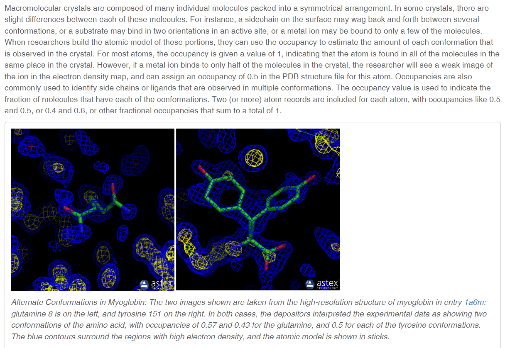
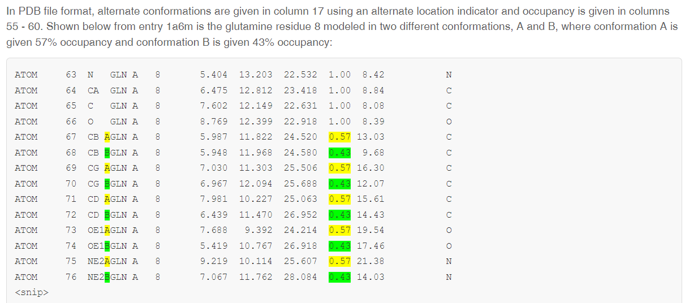

👏 PDB文件解析

---
[TOC]

---
## Occupancy and Multiple Conformations

## PDB文件格式说明
**复制别人的内容作为笔记记录在此**
### ATOM 字段
|列|数据|格式|说明|
|:----|:----|:----|:----|
|1-4|ATOM|字符，左对齐|Record Type 记录类型|
|7-11|serial|整数，右|Atom serial number 原子序号。PDB 文件对分子结构处理为 segment, chain, residue, atom 四个层次（一般并不用到 chain), 因此此数位限定了一个残基中的最大原子数为为 99999|
|13-16|name|字符，左|Atom name 原子名称。原子的元素符号在 13-14 列中右对齐，一般从 14 列开始写，占四个字符的原子名称才会从 13 列开始写。如铁原子 FE（还有氯原子 CL）写在 13-14 列，而碳原子 C 只写在 14 列。|
|17|altLoc|字符|Alternate location indicator 可替位置标示符|
|18-20|resName|字符|Residue name 残基名称|
|22|chainID|字符|Chain identifier 链标识符|
|23-26|resSeq|整数，右|Residue sequence number 残基序列号|
|27|iCode|字符|Code for insertion of residues 残基插入码|
|28-30|留空|||
|||||