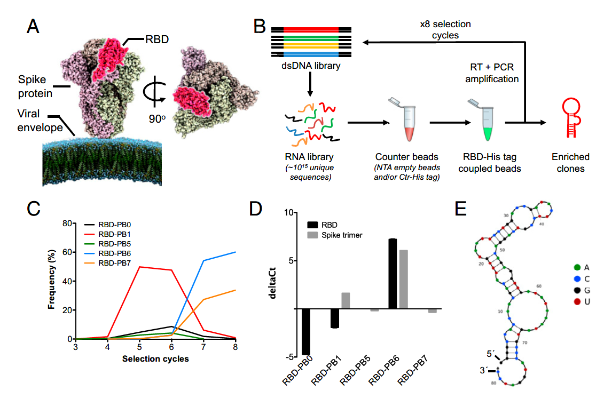

👏 RNA_Aptamer|中和新冠病毒入侵的RNA适配体

---
[TOC]

---
## 摘要
&emsp;&emsp;文中报道了能与新冠病毒S蛋白RBD高亲和力结合的RNA适配体，从而阻止S蛋白与ACE2的结合。后又发现三聚的适配体能更有效的阻止新冠病毒入侵感染。

## 背景
&emsp;&emsp;和其他冠状病毒相似，新冠病毒表面表达的S蛋白由S1和S2两个结构域组成并且形成三聚体，能和人体细胞发生相互作用。尤其是RBD结构域能与ACE2高亲和力结合，促进病毒的内吞入侵。因此中和新冠病毒感染的工作主要聚焦于抑制S蛋白与ACE2的互作。研究人员已经开发了一些作用于RBD的抗体，然而抗体生产花费高昂，稳定性差，具有增强感染的风险。

&emsp;&emsp;核酸适配体生产便宜、具有低的免疫原性、更高的稳定性和更小的尺寸，能与靶标高亲和力和特异性的结合。目前仅有很少的作用于新冠病毒的DNA适配体报道。

&emsp;&emsp;本文报道了一种血浆稳定的RNA适配体RBD-PB6，它可以与新冠病毒S蛋白的RBD结构域高亲和力结合并能中和病毒感染。后又发现该适配体多聚化之后增强了中和新冠病毒感染的特性。

## 结果
### RBD-PB6的选择、测序和截断研究
&emsp;&emsp;如下图所示，首先对RBD结构域应用8轮SELEX实验。从第6轮开始应用其他对照蛋白筛选特异性的适配体。通过多轮筛选之后选出了RBD-PB6和RBD-PB7。通过将RBD-PB6和RBD-PB7与Spike和RBD进行结合实验测试,最后发现适配体RBD-PB6对RBD以及S蛋白三聚体均具有结合能力。之后作者使用NUPACK软件预测了RBD-PB6的二级结构。

### RBD-PB6可以和新冠Spike蛋白高亲和力结合并且阻碍与ACE2相互作用
&emsp;&emsp;BLI竞争性实验确证RBD-PB6阻碍了ACE2与RBD的结合。

### RBD-PB6中和新冠病毒的侵入

## 参考文献
📜 Valero J, Civit L, Dupont D M, et al. A serum-stable RNA aptamer specific for SARS-CoV-2 neutralizes viral entry[J]. Proceedings of the National Academy of Sciences, 2021, 118(50): e2112942118. [文献pdf](./RNA_Aptamer中和新冠病毒入侵的RNA适配体/pnas.2112942118.pdf)
