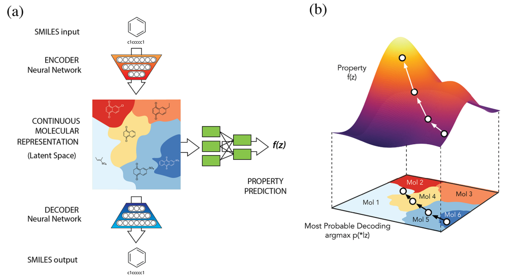

👏 分子优化|梯度优化策略探索化合物潜空间

---
[TOC]

---
## version 1

1. Gómez-Bombarelli R, Wei J N, Duvenaud D, et al. Automatic chemical design using a data-driven continuous representation of molecules[J]. ACS central science, 2018, 4(2): 268-276.

## version 2
（1）将类似的活性化合物分别与ZINC库里面的所有化合物进行结构相似性比较，选出所有相似的分子。
（2）使用VAE或者其他方式训练出来一个具有分子排布信息的化合物分布。
（3）将活性信息对照分子表示加入二维分子排布图中并拟合得到一个活性的分布三维面。
（4）对三维面进行梯度下降找到多个局部极小值。
（5）在局部极小值附近进行扰动并解码生成ZINC库中新的分子。产生Candiate。