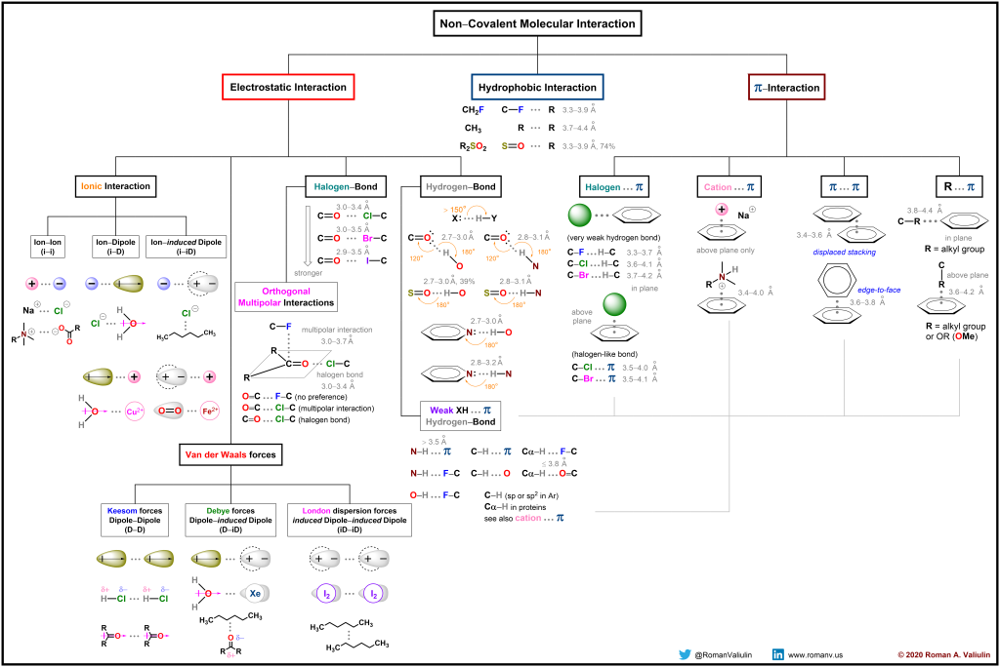

👏 原子间相互作用

---
[TOC]

---
## 共价/非共价
非共价键并不依赖电子间的共享，而是依赖正负电荷间的吸引力，因此吸力较弱，故仅需较小的力量就可将之打断。非共价键主要出现于超分子化学中，所担任的角色为：维持脱氧核糖核酸（DNA，生命的起源物质）或蛋白质的三度空间外型及功能。它包含有氢键、疏水相互作用及范德华力等，一般数量级在1-5kcal/mol（约4-21kJ/mol）之间。   -- 摘自维基百科

## 非共价作用图示

（1）疏水作用：氟原子的电负性极强并且半径小，相当于一个负的点电荷，极难被极化，所以是疏水的。
[疏水性原理](https://wenku.baidu.com/view/bca8d3ead6bbfd0a79563c1ec5da50e2524dd1c6.html?_wkts_=1669384604869&bdQuery=%E7%A0%9C%E4%B8%BA%E4%BB%80%E4%B9%88%E7%96%8F%E6%B0%B4%3F)
（2）氢键作用：氢键实际上是一种特殊的静电相互作用。氢原子的电负性很小，当氢原子与电负性较大的原子如 O、N、F、Cl、S、P等相连时，氢原子上的电子被吸附到这些电负性大的原子上而显部分正电性，当这样的基团与另外的电负性大的原子如 O、N、F等靠近时能形成一种特殊的相互作用，即氢键。氢键表述为D—H…A，其中D为氢键供体 (Donor)，A为氢键受体 (Acceptor)。标准氢键相互作用中，H 与 A 间的距离不超过2.5Å，D与 A 间的距离不超过3.5Å，D、H、A之间夹角大于120°。氢键具有方向性，D、H、A一定要满足上述条件才能形成。

**参考资料：**
1. Bissantz C, Kuhn B, Stahl M. A medicinal chemist's guide to molecular interactions. J Med Chem. 2010 Jul 22;53(14):5061-84. doi: 10.1021/jm100112j. Erratum in: J Med Chem. 2010 Aug 26;53(16):6241.
2. https://cheminfographic.wordpress.com/2020/04/13/non-covalent-molecular-interactions/