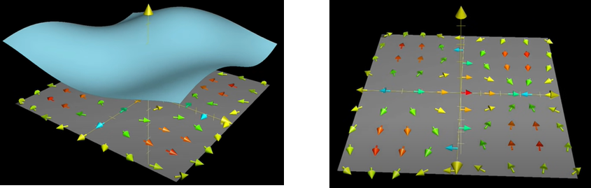
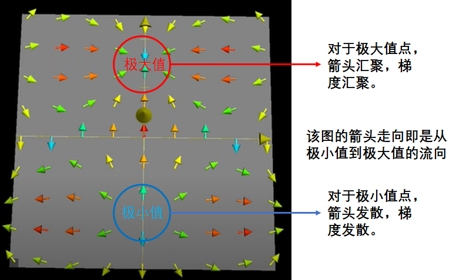
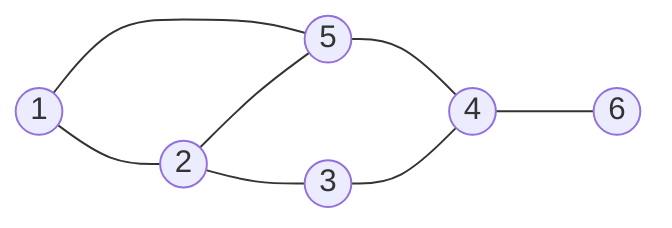
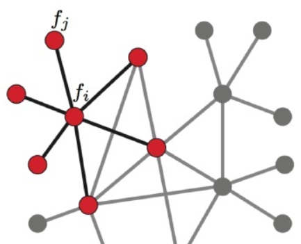

👏 图论|拉普拉斯矩阵

---
[TOC]

---
## 拉普拉斯算子与拉普拉斯矩阵
(1) 拉普拉斯矩阵是一种用于表示图的矩阵。拉普拉斯矩阵就是图上的拉普拉斯算子。  
(2) 数学语言来讲，如果$\ f$是欧式空间中的二阶可微实函数，那么$\Delta f$就是在欧式空间中求其二阶微分（散度）。如果$\ f$是图上定义的一组高维向量，那么$\ Lf$就是在图空间中求其二阶微分（散度）。  

---
## 拉普拉斯算子含义
### 梯度  
(1) 如下例所示，对于一个二维输入的函数，函数可视化如下图所示：  
  
其中箭头即是此二维输入函数在每个点处的梯度在二维平面中的投射。  
(2) 用数学语言表示即函数f(x,y)在(x,y)处的一阶连续偏导数向量$\nabla f=\frac{\partial f}{\partial x} \vec{i}+\frac{\partial f}{\partial y} \vec{j}$表示的就是该函数在该点处的梯度，记作$\nabla f(x,y)$。    
(3) 梯度的物理意义即欧式空间函数在某一点处的梯度就是该函数在该点变化率最大的方向。    

### 拉普拉斯算子
(1) 拉普拉斯算子是在N维欧氏空间中的一个二阶微分算子，定义为梯度的散度，即二阶导数。另一角度，拉普拉斯算子计算了周围点与中心点的梯度差，拉普拉斯算子计算得到的是对该点进行微小扰动后可能获得的总变化。    
(2) 用数学语言表示为：$$\Delta f=\nabla^{2} f=\nabla \cdot \nabla f=\frac{\partial^{2} f}{\partial x^{2}}+\frac{\partial^{2} f}{\partial y^{2}}$$  
(3) 如下图所示：  
  
- $\Delta f > 0$，表示该点是有散发通量的正源（发散源）。如图中的蓝圈，即散度大于0，该点是一个极值点，并且是极小值。  
- $\Delta f < 0$，表示该点是有吸收通量的负源（汇聚源）。如图中的红圈，即散度小于0，该点是一个极值点，并且是极大值。
- $\Delta f = 0$，表示该点无源。

### 梯度与拉普拉斯算子
(1) 梯度反映了函数的极值情况。  
(2) 拉普拉斯算子（梯度的散度）则反映了函数的极值是极大值还是极小值。  

---
## 图上的拉普拉斯矩阵
### 图的拉普拉斯矩阵计算公式
(1) 如下图所示，给定一个有n个顶点的图G=(V,E)，其拉普拉斯矩阵被定义为L=D-A，D其中为图的度矩阵，A为图的邻接矩阵。  

(2) 该图的邻接矩阵A如下所示，邻接矩阵也就是权重矩阵W：$$\left(\begin{array}{llllll}
0 & 1 & 0 & 0 & 1 & 0 \\
1 & 0 & 1 & 0 & 1 & 0 \\
0 & 1 & 0 & 1 & 0 & 0 \\
0 & 0 & 1 & 0 & 1 & 1 \\
1 & 1 & 0 & 1 & 0 & 0 \\
0 & 0 & 0 & 1 & 0 & 0
\end{array}\right)$$
(3) 把W的每一列元素加起来得到N个数，然后把它们放在对角线上（其它地方都是零），组成一个N×N的对角矩阵，记为度矩阵D，如下所示。$$\left(\begin{array}{llllll}
2 & 0 & 0 & 0 & 0 & 0 \\
0 & 3 & 0 & 0 & 0 & 0 \\
0 & 0 & 2 & 0 & 0 & 0 \\
0 & 0 & 0 & 3 & 0 & 0 \\
0 & 0 & 0 & 0 & 3 & 0 \\
0 & 0 & 0 & 0 & 0 & 1
\end{array}\right)$$
(4) 则拉普拉斯矩阵L=D-A，即为：$$\left(\begin{array}{rrrrrr}
2 & -1 & 0 & 0 & -1 & 0 \\
-1 & 3 & -1 & 0 & -1 & 0 \\
0 & -1 & 2 & -1 & 0 & 0 \\
0 & 0 & -1 & 3 & -1 & -1 \\
-1 & -1 & 0 & -1 & 3 & 0 \\
0 & 0 & 0 & -1 & 0 & 1
\end{array}\right)$$

### 图的拉普拉斯矩阵含义及公式推导
  
(1) 如上具有N个节点的图G所示，用函数$\ f$表示该图，则$\ f= \left(f_{1}, f_{2}, \ldots, f_{N}\right)$。其中$\ f_{i}$是函数在节点$\ i$处的函数值。类似于$\ f(x, y)$在节点$\ (x,y)$处的值。对$\ i$节点进行扰动，它可能变为任意一个与它相邻的节点$\ j \in N_{i}$，$\ N_{i}$表示节点$\ i$的一阶邻域节点。  
(2) 拉普拉斯算子可以计算一个点到它所有自由度上微小扰动的增益，若用图来表示即是任意一个节点$\ j$变化到节点$\ i$所带来的增益，则有：
$$\Delta f_{i}=\sum_{j \in N_{i}} W_{i j}\left(f_{i}-f_{j}\right)$$ 
两个节点不相邻时$\ W_{ij}=0$，则上式可简化为：
$$\Delta f_{i}=\sum_{j \in N} w_{i j}\left(f_{i}-f_{j}\right) \\
=\sum_{j \in N} w_{i j} f_{i}-\sum_{j \in N} w_{i j} f_{j} \\
=d_{i} f_{i}-w_{i:} f$$   
其中$d_{i}=\sum_{j \in N} w_{i j}$是顶点$\ i$的度，$w_{i:}=\left(w_{i 1}, \ldots, w_{i N}\right)$是N维行向量，代表顶点$\ i$与其他节点间的权重关系；$f=\left(f_{1}, \ldots, f_{N}\right)^T$是N维列向量，是每个节点自身的特征向量；$\ w_{i:}f$是两个向量的内积。  
(3) 对于具有N个节点的一张图，则有：  
$$\begin{array}{l}
\Delta f=\left(\begin{array}{c}
\Delta f_{1} \\
\vdots \\
\Delta f_{N}
\end{array}\right)=\left(\begin{array}{cc}
d_{1} f_{1}-w_{1:} f \\
\vdots \\
d_{N} f_{N}-w_{N:} f
\end{array}\right) \\
=\left(\begin{array}{ccc}
d_{1} & \cdots & 0 \\
\vdots & \ddots & \vdots \\
0 & \cdots & d_{N}
\end{array}\right) f-\left(\begin{array}{c}
w_{1:} \\
\vdots \\
w_{N:}
\end{array}\right) f \\
=\operatorname{diag}\left(d_{i}\right) f-W f \\
=(D-W) f \\
=L f
\end{array}$$
(4) 拉普拉斯矩阵中的第$\ i$行反应了第$\ i$个节点在对其他所有节点产生扰动时所产生的增益累积。图拉普拉斯反映了当我们在节点$\ i$上施加一个势，这个势以哪个方向能够多顺畅的流向其他节点。  

---
## 参考资料
1. [拉普拉斯矩阵的含义](https://zhuanlan.zhihu.com/p/84649941)  
2. [graph Laplacian 拉普拉斯矩阵](https://blog.csdn.net/Twenty_seven/article/details/54755732)  
3. [可视化理解拉普拉斯算子和二阶导数](https://www.kechuang.org/t/84022)  
4. [拉普拉斯矩阵与拉普拉斯算子的关系](https://zhuanlan.zhihu.com/p/85287578)  
5. [拉普拉斯矩阵（Laplacian matrix）](https://blog.csdn.net/qq_30159015/article/details/83271065)