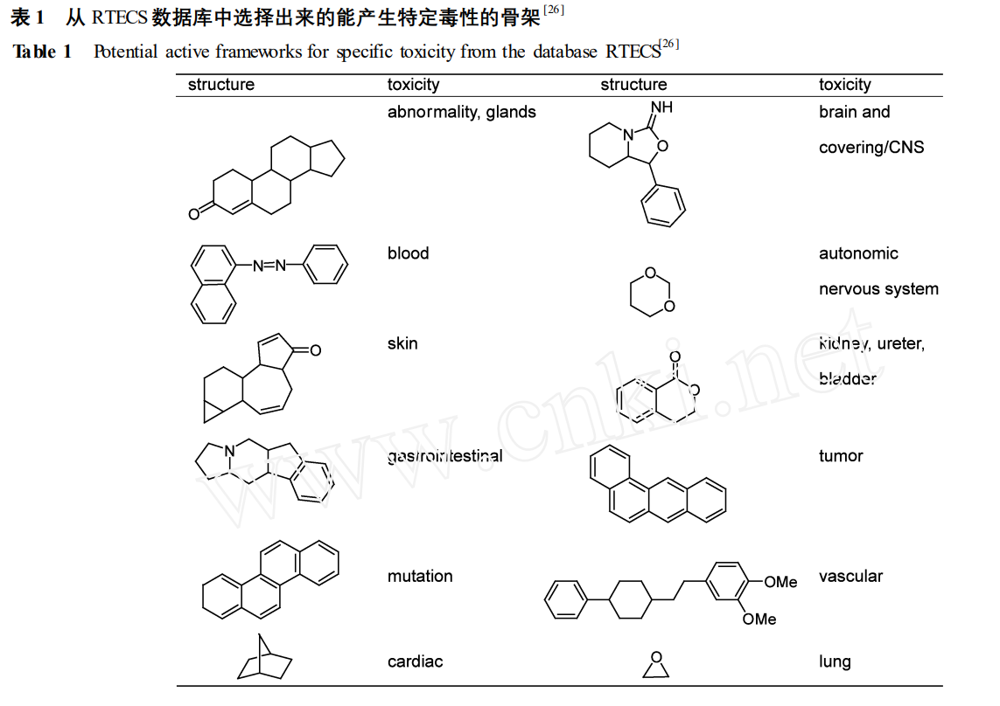

👏 小分子性质预测

---
[TOC]

---
## 小分子体外非生物降解性质预测
1. EPI Suite
下载网址：https://www.epa.gov/tsca-screening-tools/download-epi-suitetm-estimation-program-interface-v411
但是这个软件的安装对操作系统的要求较高，无法在最新的win11上安装。

2. 相关论文：Prediction of the Fate of Organic Compounds in the Environment From Their Molecular Properties: A Review

## 类药性
1. 论文：类药性 :预测与实践（中国医学科学院北京协和医学院药物研究所）

