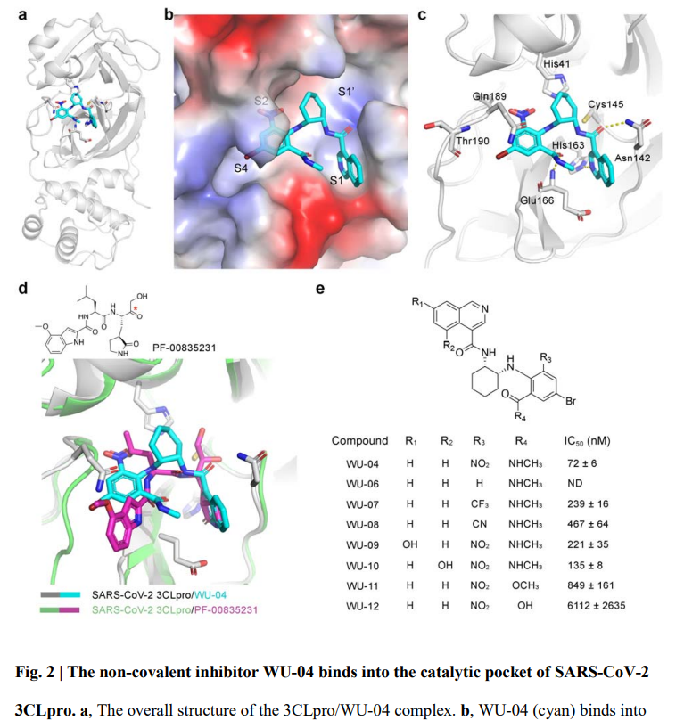

👏 小分子|新冠病毒3CL蛋白异喹啉骨架化合物

---
[TOC]

---
* Hagit Achdout, Anthony Aimon, Elad Bar-David, Open Science Discovery of Oral Non-Covalent SARS-CoV-2 Main Protease Inhibitor Therapeutics, doi: https://doi.org/10.1101/2020.10.29.339317 [大规模筛选发现抗3CL异喹啉骨架hit的预印版文章pdf](./小分子新冠病毒3CL蛋白异喹啉骨架化合物/2020.10.29.339317v3.full.pdf)
* Glaser J, Sedova A, Galanie S, et al. Hit Expansion of a Noncovalent SARS-CoV-2 Main Protease Inhibitor. ACS Pharmacol Transl Sci. 2022 Apr 4;5(4):255-265. [对异喹啉骨架化合物进一步结构改造并解出复合物晶体结构的文献pdf](./小分子新冠病毒3CL蛋白异喹啉骨架化合物/pt2c00026.pdf)
* Rossetti GG, Ossorio MA, Rempel S, et al. Non-covalent SARS-CoV-2 Mpro inhibitors developed from in silico screen hits. Sci Rep. 2022 Feb 15;12(1):2505. [喹啉酮骨架类似物的抗3CL活性以及复合物晶体结构文章pdf](./小分子新冠病毒3CL蛋白异喹啉骨架化合物/s41598-022-06306-4.pdf)
* Chodera J, Lee A A, London N, et al. Crowdsourcing drug discovery for pandemics[J]. Nature Chemistry, 2020, 12(7): 581-581. [COVID Moonshot组织的简介及来源的文章pdf](./小分子新冠病毒3CL蛋白异喹啉骨架化合物/s41557-020-0496-2.pdf)
* Douangamath A, Fearon D, Gehrtz P, et al. Crystallographic and electrophilic fragment screening of the SARS-CoV-2 main protease. Nat Commun. 2020 Oct 7;11(1):5047. [Fragment crystal structure with 3CL protein pdf](./小分子新冠病毒3CL蛋白异喹啉骨架化合物/s41467-020-18709-w.pdf)

* [Development of highly potent non-covalent inhibitors of SARS-CoV-2 3CLpro](https://www.biorxiv.org/content/10.1101/2022.08.10.503531v1.abstract)
