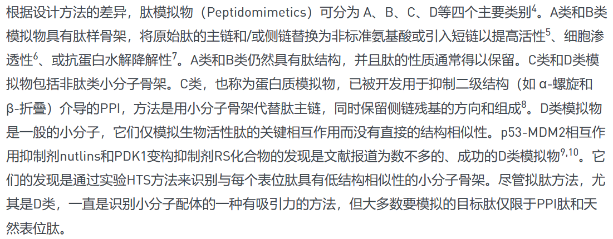

👏 拟肽

---
[TOC]

---
## 拟肽类别

【4】 [Structure-Based Design of Inhibitors of Protein–ProteinInteractions: Mimicking Peptide Binding Epitopes](拟肽/Angew%20Chem%20Int%20Ed%20-%202015%20-%20Pelay%E2%80%90Gimeno%20-%20Structure%E2%80%90Based%20Design%20of%20Inhibitors%20of%20Protein%20Protein%20Interactions%20%20Mimicking.pdf)