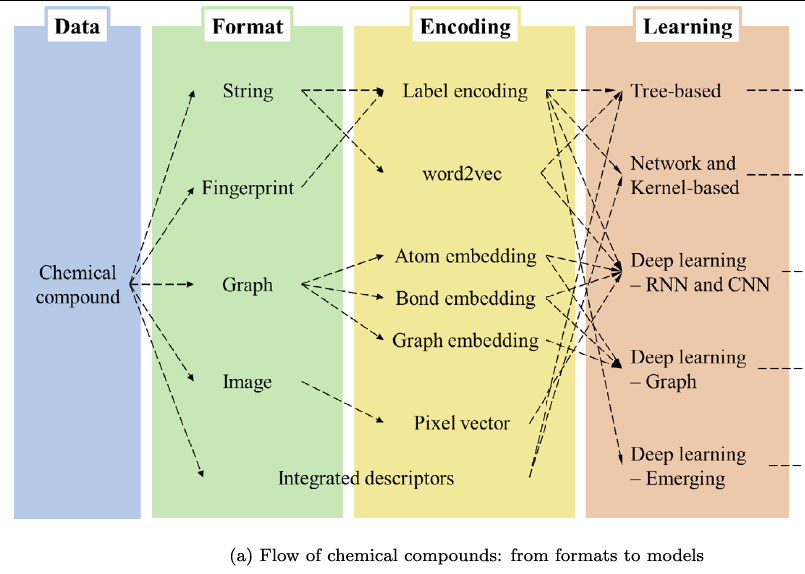
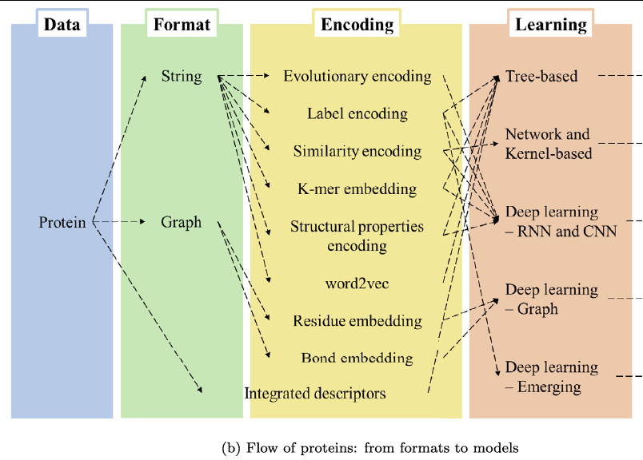
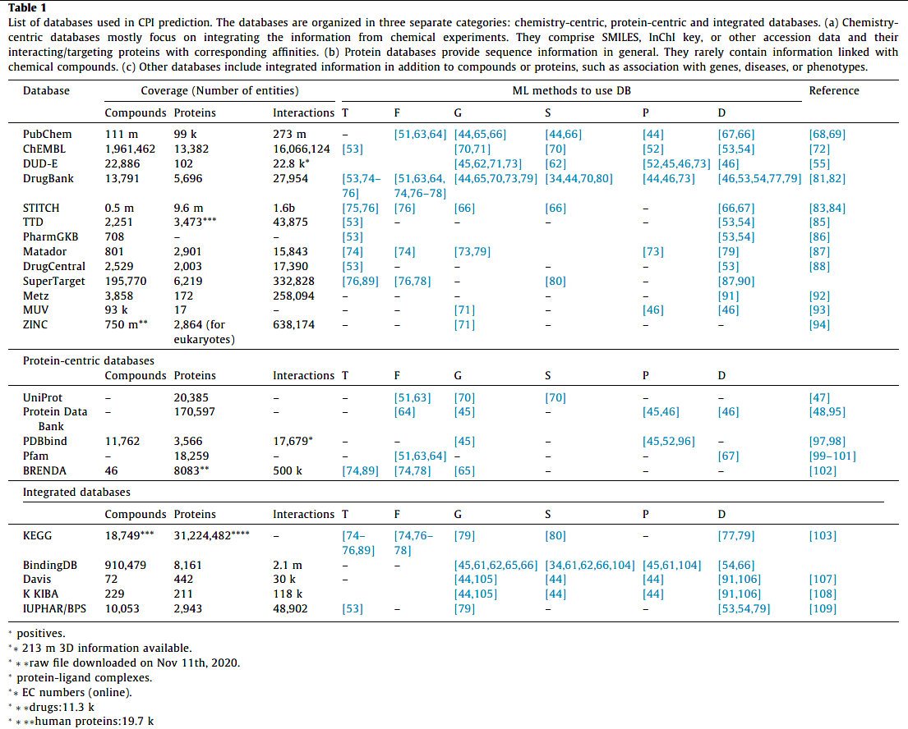
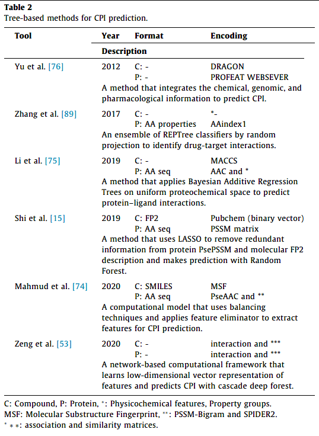
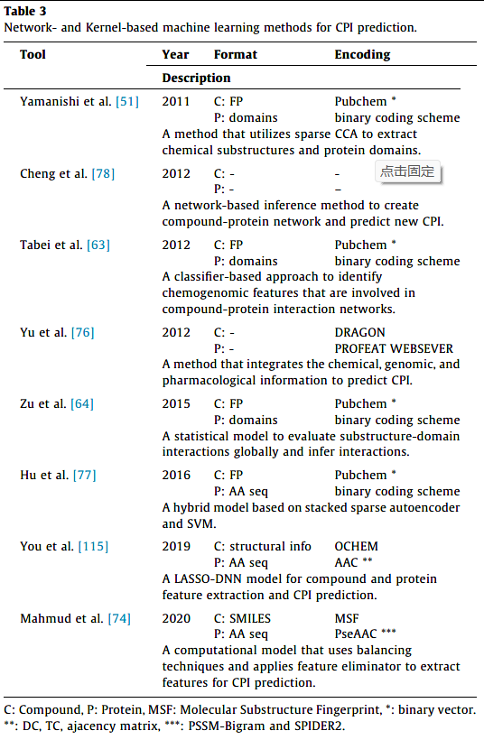
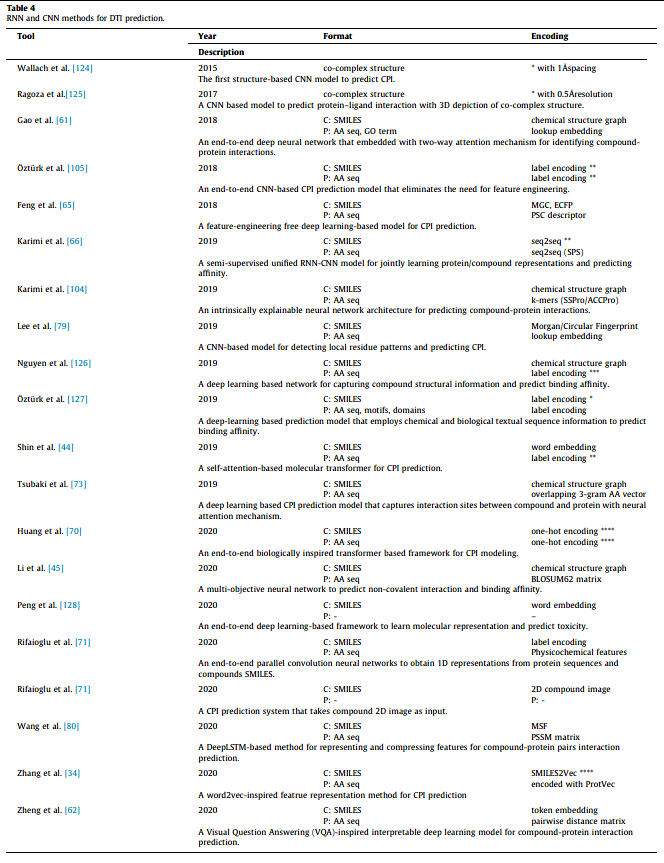
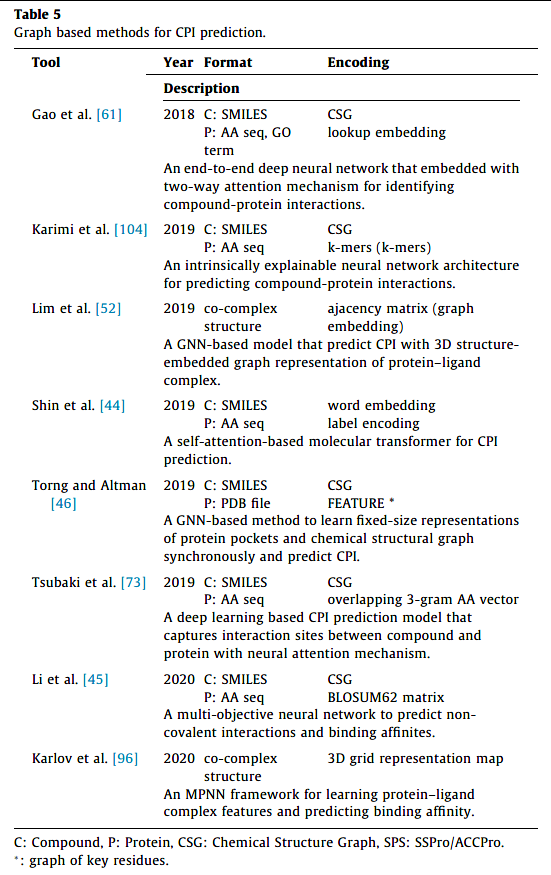
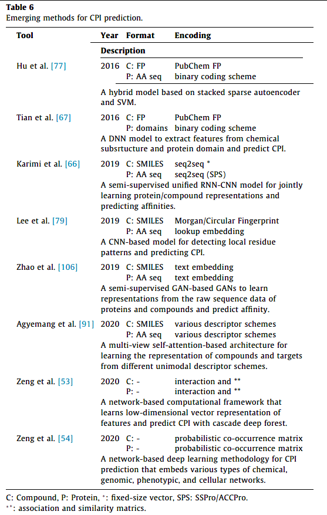
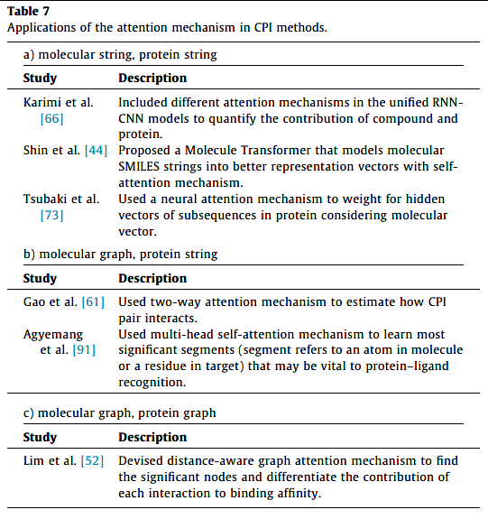

👏 文献阅读|使用AI方法预测CPI综述

---
[封面PPT](../PPT/文献阅读使用AI方法预测CPI综述.pptx)

---
[TOC]

---
## 文献
[A review on compound-protein interaction prediction methods: Data, format, representation and model](https://doi.org/10.1016/j.csbj.2021.03.004)

---
## 写在前面
1. 蛋白质和配体间的结合亲和力可用于表征蛋白配体间的结合强度。可以通过实验的方法测得，但是生物实验测试耗时耗力并且规模和速度都是有限的。利用计算机辅助模拟的方法可用于辅助预测蛋白配体结合亲和力，有效帮助虚拟筛选和药物设计。  
2. 用于计算蛋白配体间结合亲和力的传统方法有分子对接和MM/GBSA计算。但是此两种方法往往受限于打分函数。预测准确度有待提升。  
3. AI的兴起使得药物科学家开发了诸多用于预测蛋白配体结合亲和力的方法。本文即对近年来AI预测蛋白配体间结合亲和力的方法进行了综述。

---
## 数据编码
(1) 小分子化合物  

(2) 蛋白  

---
## CPI可用数据集

---
## 预测方法
(1) 基于树的预测方法  

(2) 基于网络和基于核函数的预测方法  

(3) RNN和CNN预测方法  

(4) 基于结构图的预测方法  

(5) 新兴技术预测方法  

(6) 注意力机制预测方法  
