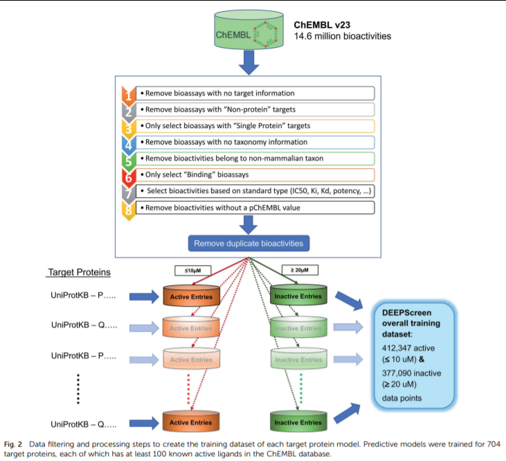
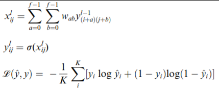
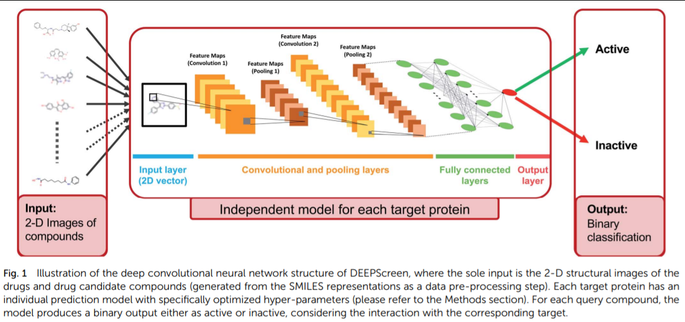
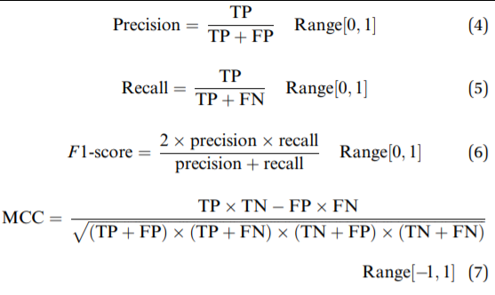
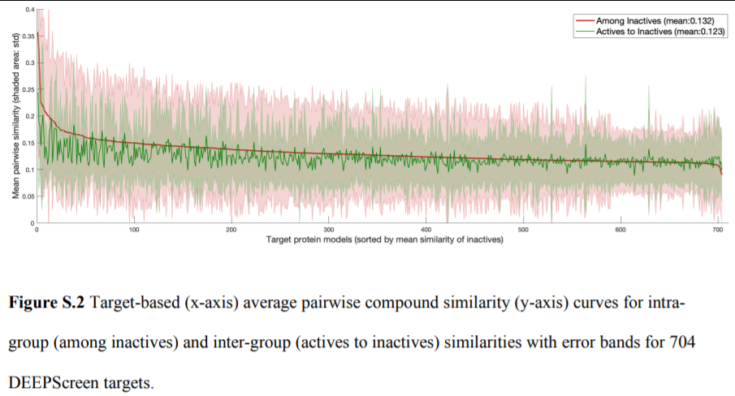
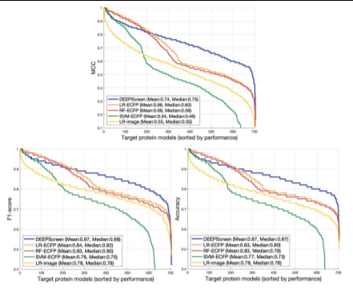
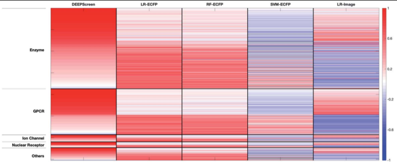
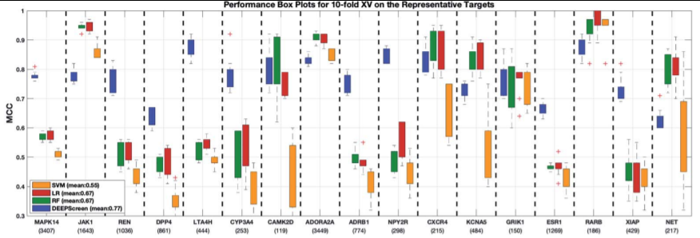

👏 文献阅读|使用化合物图片作为输入预测化合物靶标相互作用

---
[封面PPT](../PPT/文献阅读使用化合物图片作为输入预测化合物靶标相互作用.pptx)

---
[TOC]

---
## 文章
Title: [DEEPScreen: high performance drug–target interaction prediction with convolutional neural networks using 2-D structural compound representations](https://pubs.rsc.org/en/content/articlelanding/2020/sc/c9sc03414e)  
DOI: 10.1039/c9sc03414e  
期刊：Chemical Science  

## 创新
(1) 以化合物图片(image)作为输入，使用化合物图片编码进行特定靶标的分类模型训练。  
(2) 结合实验验证证明了该方法的有效性。  

## 摘要
这篇文章构建了一个基于卷积神经网络的DTI预测模型DEEPSCreen。该模型的优势在于将化合物的2D结构图片作为输入，使用卷积进行特征提取，代替了传统的特征描述符，提高了预测准确性。基于704个靶标蛋白训练了704个模型，并且在基准数据集上将DEEPSCreen和其他最先进的方法进行了比较，还进一步通过分子对接和文献调研进行了验证。此外还有生物实验验证，即DEEPSCreen发现的氯法拉滨的新靶标JAK蛋白得到了生物实验验证。  

3种验证方式：  
- 文献调研老药新用验证
- 分子对接验证
- 生物实验验证

## 方法
### 训练数据集的前处理
  
要点：  
(1) 对于同一化合物靶标对的多次生物实验结果取中位数。  
(2) 阳性化合物和阴性化合物的划分，<=10μM是阳性，>=20μM是阴性。  
(3) 数据集平衡问题，以阳性化合物为基准，保证阴性化合物数量等于阳性化合物数量。原理是序列相似的靶标有相似的阳性和阴性化合物结构。方法如下：
- 将目标序列与其他所有序列进行多序列比对
- 将与目标序列相似性高的靶标阴性化合物作为目标序列阴性化合物
- 设置20%为序列相似性阈值，低于20%序列相似性的不予考虑

### 数据输入
(1) 使用RDKit根据正则SMILES生成固定朝向以及固定格式的200\*200像素的化合物2D图片。忽略了立体化学因素。  
(2) 选择合适的图片尺寸。对于3种靶标选择3种尺寸的图片输入(100\*100、200\*200和400\*400)建立9个模型。比较之后发现200\*200是最优的尺寸。  

### 模型架构
(1) 卷积公式、激活函数和交叉熵损失函数  
  
(2) 池化、dropout  
(3) 详细介绍网络架构以及网络层  
  

### 训练测试模型
(1) 训练集、验证集和测试集划分  
对于每个靶标，随机挑选80%作为训练/验证集，剩下的20%作为独立的外部测试集。  
将挑选出的80%分子再挑选80%作为训练集，余下的20%作为验证集。  
(2) 调参，用少批量数据选择最优化超参数。  
模型评价指标(accuracy、precision、recall、F1-score、MCC)此处用MCC作为指标挑选超参数。  

### 用于模型间比较的基准数据集
(1) 基于ChEMBL训练集生成的无偏基准数据集  
(2) [Beyond the hype: deep neural networks outperform established methods using a ChEMBL bioactivity benchmark set](https://pubmed.ncbi.nlm.nih.gov/29086168/)文章中生成的一个高质量ChEMBL子集。  
(3) Maximum Unbiased Validation (MUV)  
(4) DUD-E  

### JAK蛋白作为氯法拉滨新靶标的生物实验

### 文献调研验证
DEEPScreen产生了两千万左右新的DTI预测结果，对于这么多的结果无法一一验证预测结果的准确性。所以采用以下两种方式进行验证：  
- 从更新的 ChEMBL v24 中找出 ChEMBL v23 中所没有的新的DTI使用DEEPScreen进行验证。
- 从文献中找出最新报道的DTI进行验证。  

### 分子对接验证
普通的分子对接。  

### 模型评价指标
  

## 结果
### DTI模型DEEPScreen
根据方法中的步骤创建数据集、构建并训练模型。  

### 模型评估中数据集偏差来源
(1) 训练集、验证集和测试集划分方式：  
- 随机划分
- 根据结构骨架相似性进行划分(相似骨架的分子不要同时划分在训练集和验证集中)

(2) 数据集偏差
- 测试集的化学偏差，结构相似的化合物同时分布在训练集和测试集中，导致高估模型的性能。  
- 阴性数据选择偏差，训练集和测试集中的阴性数据有结构相似性，且此相似结构与结合作用无关。导致模型易于区分阳性和阴性化合物，从而高估模型性能。  

### DEEPScreen数据集的阴性选择偏差分析
(1) 比较每个靶标的阴性化合物结构间的相似性。  
(2) 比较每个靶标的阳性化合物与阴性化合物结构间的相似性。  
(3) 进行t-test。  
相似性比较结果如下图所示：  
  

### DEEPScreen与其他方法比较
(1) 随机划分的数据集上比较  
1. 将DEEPScreen与其他三种传统算法进行(随机森林、SVM和逻辑回归)比较，其中三种传统算法的数据输入格式又分为两种(分子指纹输入和图片向量输入)。所以一共会产生7种模型，将7种模型进行比较。
2. 由于结果显示7种模型中有2种的效果显著较差，故将其2种模型排除，比较剩余的5种模型。首先比较所有靶标的5种模型的MCC、F1-score和ACC。如下图所示：  
  
3. 根据蛋白家族进行分类，基于5种模型，将不同家族的蛋白进行比较，发现主要蛋白家族中DEEPScreen均优于其他模型，并且DEEPScreen与其他基于指纹的传统模型互补。如下图所示：  
  
4. 从数理统计基础上比较DEEPScreen和传统方法。选择了代表性的17种靶标蛋白，使用5种模型进行十折交叉验证并进行统计检验分析。如下图：  
  
5. 将所有模型进行两两之间比较制作相关性矩阵，检查模型性能与模型类型之间的相关性。目的是看DEEPScreen和传统模型之间是否存在互补性。  
6. 检查模型性能与训练集数据量之间的相关性。使用斯皮尔曼秩相关系数进行表示。  

(2) 基于结构相似性分割的数据集上比较  
1. 在新组建的基于结构相似性的数据集上进行模型比较的结果
2. 在ChEMBL时间分割数据集上进行模型比较的结果
3. 在MUV数据集上进行模型比较的结果
4. 在DUD-E数据集上进行模型比较的结果

### 预测结果的生物实验验证
DEEPScreen的预测结果显示氯法拉滨的新靶标JAK1、JAK2和JAK3，结合生物实验进行验证。  

### 预测结果的分子对接验证
DEEPScreen预测了作用于肾素蛋白的潜在活性小分子。结合分子对接进行验证。  

### 文献调研验证预测结果
DEEPScreen产生了大量新的DTI预测结果。结合新发表的文献进行验证结果的正确性。  
