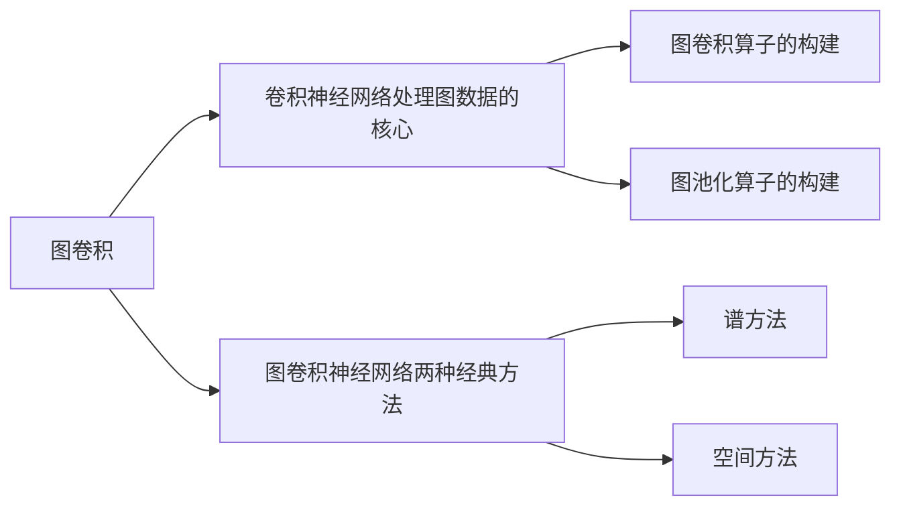

👏 文献阅读|图卷积神经网络综述

---
[TOC]

---
## 文献
图卷积神经网络综述  

---
## 摘要

```mermaid
graph LR
    S[图卷积] --> A[卷积神经网络处理图数据的核心] --> A1[图卷积算子的构建]
    A --> A2[图池化算子的构建]
    S --> B[图卷积神经网络两种经典方法] --> B1[谱方法]
    B --> B2[空间方法]
```
(1) 常规的卷积神经网络具有平移不变性，但是图数据由于每个节点的异质性导致平移不变性的缺失，所以给卷积核的定义带来了较大困难。  

## 

目前根本看不懂。。。。  