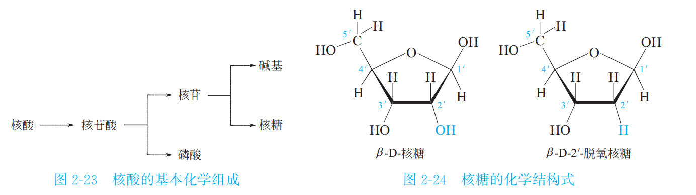
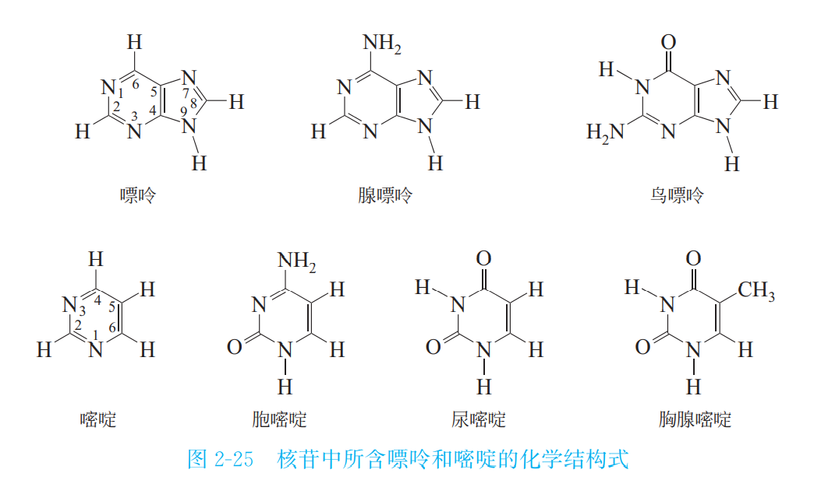
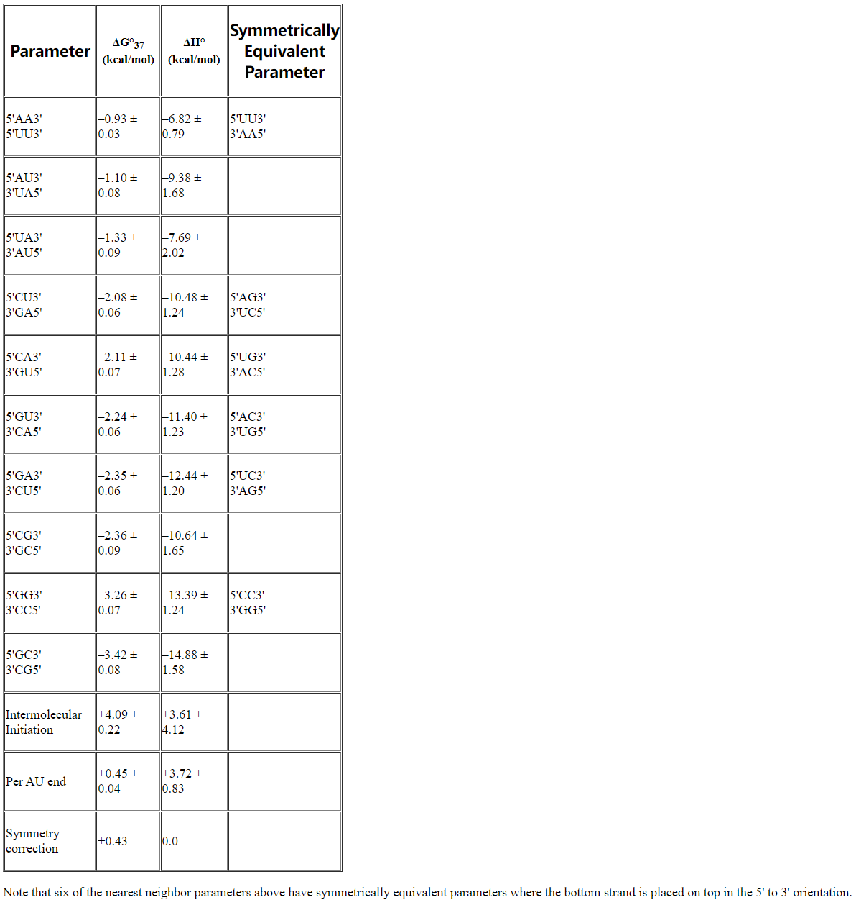

👏 核酸|核酸及碱基结构详解

---
[TOC]

---
## 核酸基础
（1）核酸的基本组成单位是核苷酸 (Nucleotide),核苷酸由核苷 (Nucleoside)和磷酸组成,核苷又由碱基和核糖组成。磷酸根和核糖构成核酸的主链骨架,碱基则为侧链。
（2）核糖结构如下图所示：

（3）碱基结构如下图所示：

## 碱基互补配对的能量

**参考资料：**
1. http://rna.urmc.rochester.edu/NNDB/turner04/wc-parameters.html

## temp
* [碱基互补配对，可不止AT和CG那么简单](https://zhuanlan.zhihu.com/p/36450470)