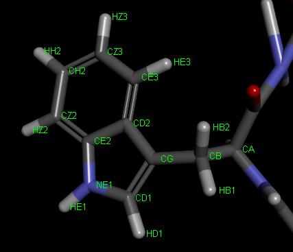
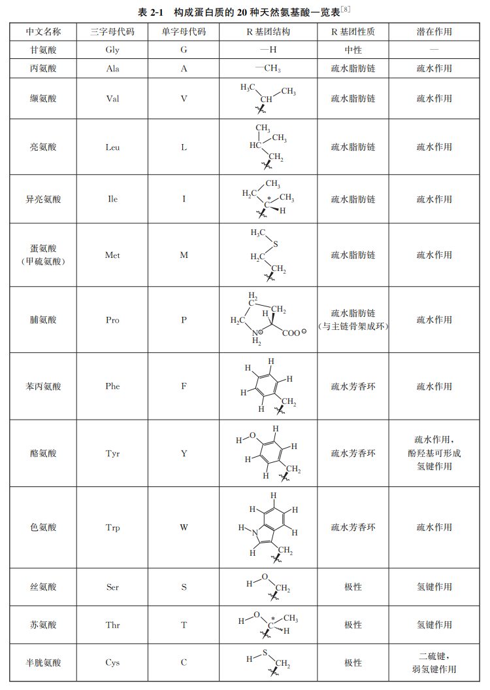
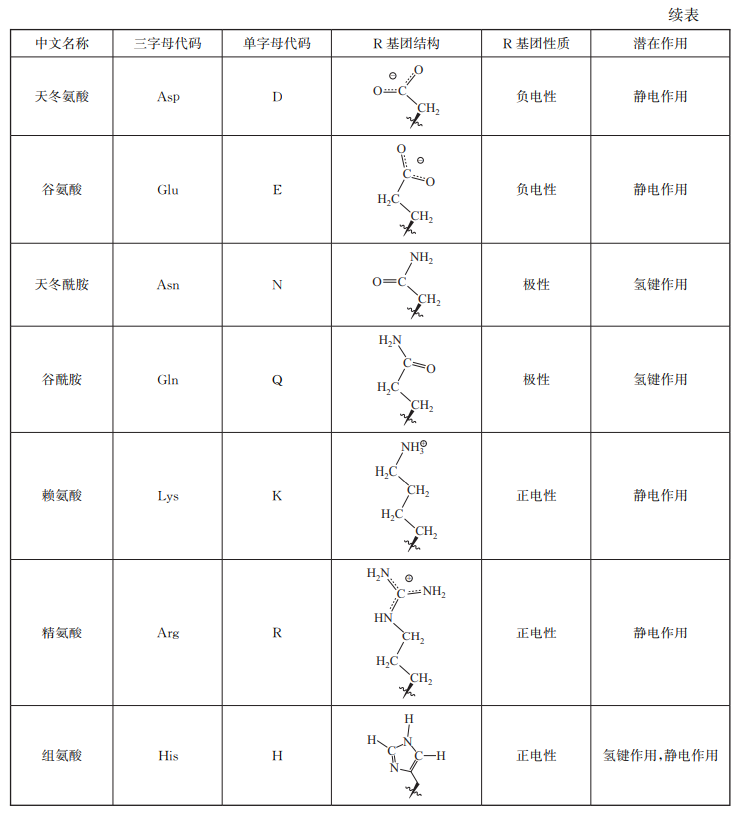

👏 氨基酸|常见的20种氨基酸详解

---
[TOC]

---
## 氨基酸原子命名规则

（1）氨基和羧基上的原子都采用本名，C，N，O，H，etc。
（2）其它原子除H外，所有原子命名均采用“原子名+后缀[编号]”形式。首先α-C被命名为CA。其后按照成键关系逐级递推，名字后缀依次为 B-G-D-E-Z-H-...（此为希腊字母表顺序：α(A)，β(B)，γ(G)，δ(D)，ε(E)，ζ(Z)，η(H)……）。
（3）对于氢原子，命名采用“H+所连原子后缀[编号]”形式。例如连接在CD1上的H命名为HD1，连接在CB上的H命名为HB1和HB2，etc.。

参考资料：[氨基酸在PDB文件中的原子命名规则](https://blog.sciencenet.cn/blog-3387981-1118283.html)

## 氨基酸详解
[20种氨基酸excel表](./氨基酸常见的20种氨基酸详解/氨基酸常见的20种氨基酸详解.xlsx)
如下图所示：（来源：药物设计学-唐赟）

