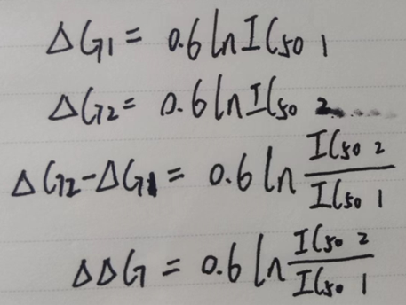

👏 物理化学生物性质相关指标

---
[TOC]

---
## 1. (logSw和logP)小分子化合物水溶性和脂溶性指标
(1) logSw代表的是小分子化合物的水溶性指标       
logSw越小表示化合物的水溶性越低，越大代表化合物的水溶性越高。        
等级0：logSw < -8 表示化合物的水溶性极低。      
等级1：-8 < logSw < -6 表示化合物的水溶性非常低。      
等级2：-6 < logSw < -4 表示化合物的水溶性低。     
等级3：-4 < logSw < -2 表示化合物的水溶性好。    
等级4：-2 < logSw < 0 表示化合物的水溶性最佳。     
等级5：logSw > 0 表示化合物的水溶性过高。     
       
(2) logP是油水分配系数，是物质在正辛醇和水中的分配系数比值的对数值。      
logP反映了物质在油水两相中的分配情况。logP值越大，说明该物质越亲油，反之，越小，则越亲水，即水溶性越好。        

---
## 2. IC50、EC50、Ki、Kd、Ka、Km、Kon、Koff

参考资料：    
1. https://zhuanlan.zhihu.com/p/29900912       

---
## 3. IC50/Ki/Kd与结合自由能ΔG的转换计算
$$\Delta \text G_{binding} =\mathrm{RT} \cdot \ln \mathrm{K} _{ dissociated }=\mathrm{RT} \cdot \ln \mathrm{K_d} \approx \mathrm{RT} \cdot \ln \mathrm{IC} _{50}=-\mathrm{RT} \cdot \mathrm{pIC} _{50}$$
其中，R = 8.314J/mol/K；T（K）= 273.15 + t（℃）；1kcal = 4185.851820846J
在室温300K时：
$$\Delta \text G_{binding} \approx 8.314 * 300 / 4185.85 \ln IC_{50}=0.596 \ln IC_{50} \approx 0.6 \ln IC_{50}=1.37 \text pIC_{50}$$

**参考资料：**
1. [IC50/Ki/Kd与结合自由能ΔG的转换计算](https://www.wecomput.com/ic50-ki-kd-binding-free-energy/)