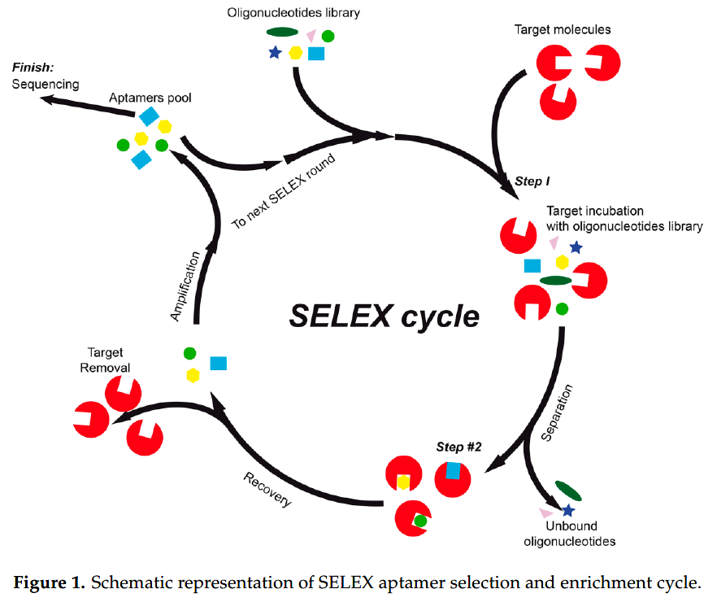
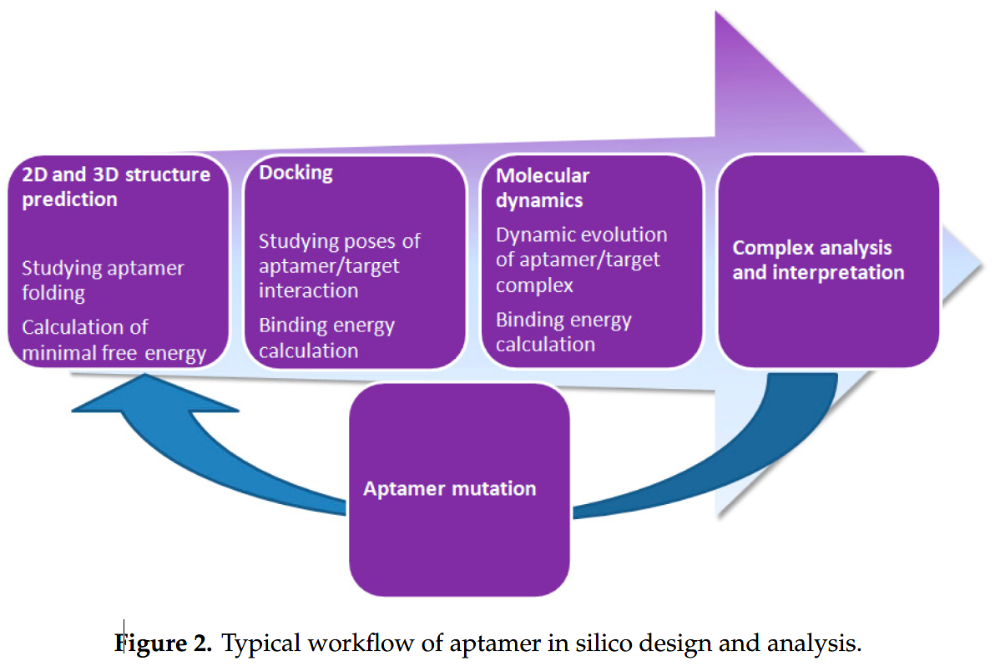
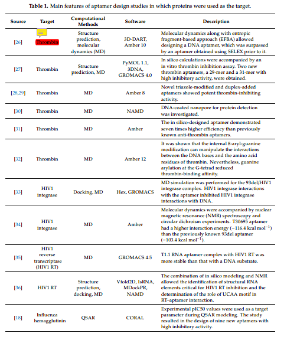
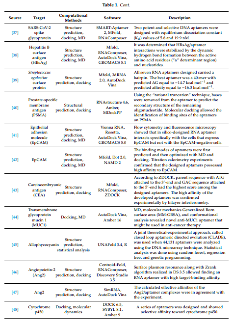
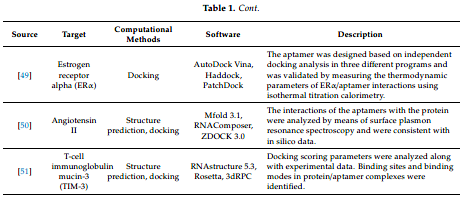
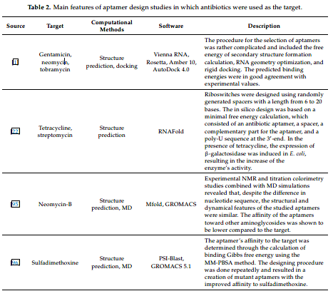
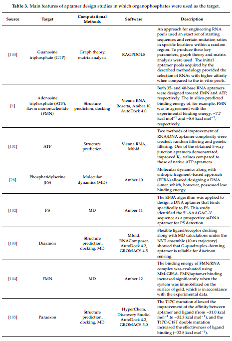

👏 综述|计算机辅助适配体设计和建模的方法和应用  

---
[TOC]

---
## 摘要
&emsp;&emsp;适配体是核酸类似物，可通过高亲和力和特异性与靶蛋白等靶标分子结合。这篇文章综述了适配体设计的理论研究以及理论-实践研究。在计算机辅助核酸建模和设计中，需要用到对接、分子动力学和数据统计分析等方法。一般的建模流程是：首先进行结构预测，然后将适配体和核酸进行对接，接着进行动力学模拟评估靶标-适配体的结合稳定性并分析互作模式，最后对适配体进行合理突变再次进入上述循环过程。

## 研究背景
&emsp;&emsp;在过去的数年间，研究已经获得了多种靶标的适配体，其在生物医药领域以及纳米材料领域获得了广泛应用。

&emsp;&emsp;指数富集的配体系统进化技术（Systematic Evolution of Ligands by Exponential Enrichment，SELEX）是一种能够鉴定与靶标具有高亲和力和特异性的核酸适配体的实验方法，如下图所示。该方法是在体外化学合成一个单链寡核苷酸库，用它与靶物质混合，通过重复的筛选与扩增，洗去与靶物质不结合或与靶物质有高亲和力外的核酸分子，分离纯化与靶物质高度亲和的核酸适体。SELEX技术及核酸适体具有库容量大，适应范围广泛；分辨率高，实用性强；亲和力高；筛选过程相对简便、快速、经济；适配子体积小等优势。该技术体外诊断和体内治疗及药物的开发等方面都具有应用。但是SELEX需要消耗大量时间和劳力并且效率和结果低下。  
  

&emsp;&emsp;适配体的设计和优化主要有两大步骤。第一步是即是使用SELEX方法筛选出对靶标有亲和力的适配体候选物。第二步是对候选物进行修饰提高亲和力和活性。

&emsp;&emsp;过去十几年间，分子对接和分子动力学等生物信息计算方法已被用于设计多种适配体。计算方法可以与SELEX等实验方法一同使用用于提高研究效率。

&emsp;&emsp;现已有几种寡核苷酸适配体设计方法：RNA适配体的缩放聚类、寻找模体方法以及适配体优化方法。另外，核酸适配体对接相关的打分函数、对接、动力学模拟、QM/MM、QSAR等方法均可用于适配体的设计。

&emsp;&emsp;非编码RNA（ncRNA）具有基因开关的功能，能够调控特定靶标分子的基因表达，是一个核糖开关。其是一种负责调控的RNA组分，通常位于mRNA的5'非转录区域，控制转录和翻译过程钟的基因表达。这些组分含有一个感受器结构域和一个邻居激动结构域。感受器结构域是能够与配体对象结合的适配体，邻居激动结构域包含调控转录和翻译的核糖体结合位点。大部分研究都表明寡聚核酸适配体的设计属于RNA核糖开关的开发。

&emsp;&emsp;分子建模方法和体外SELEX实验方法可以相互补充。使用分子建模方法能够发现对靶标具有更高亲和力的适配体并且能够确证靶标-适配体间的相互作用以便进行突变进而结构优化。典型的适配体研究策略如下图所示：

&emsp;&emsp;接下来文章根据适配体靶标类型进行分类对计算机辅助适配体建模和设计方法的应用进行介绍。

## 以蛋白为靶标的适配体设计
&emsp;&emsp;通过对核酸适配体的调研发现核酸适配体研究的目的主要有三：一是通过计算加实验改善适配体的亲和力，二是找到蛋白-适配体结合的作用模式，三是发展新的适配体设计技术。可以将适配体研究的蛋白靶标分为四大类：凝结物相关蛋白、感染相关蛋白、癌症相关蛋白和其他蛋白。计算方法与研究成果见下表所示，整个分子建模方法主要包括二级/三级结构预测、对接、分子动力学和QSAR。

## 抗生素作为靶标的适配体设计
&emsp;&emsp;如下表所示。

## 有机磷酸酯作为靶标的适配体设计
&emsp;&emsp;如下表所示。
  

## 不同的低分子量化合物作为靶标的适配体设计
&emsp;&emsp;如下表所示：

## 参考文献
📜 Buglak A A, Samokhvalov A V, Zherdev A V, et al. Methods and applications of in silico aptamer design and modeling[J]. International Journal of Molecular Sciences, 2020, 21(22): 8420. [文献pdf](./综述计算机辅助适配体设计和建模的方法和应用/ijms-21-08420.pdf)