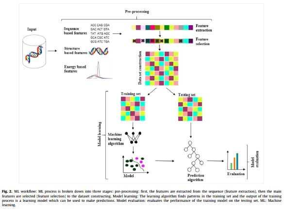
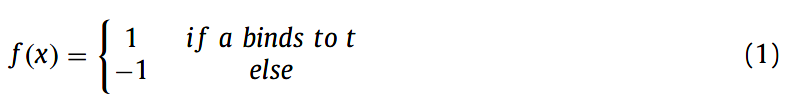
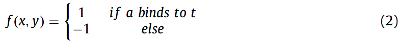
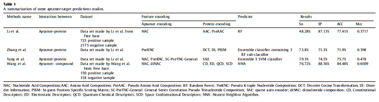
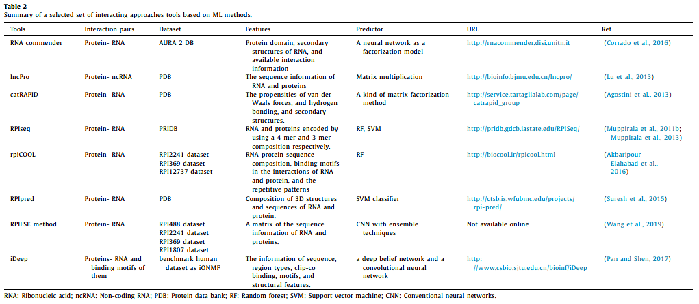
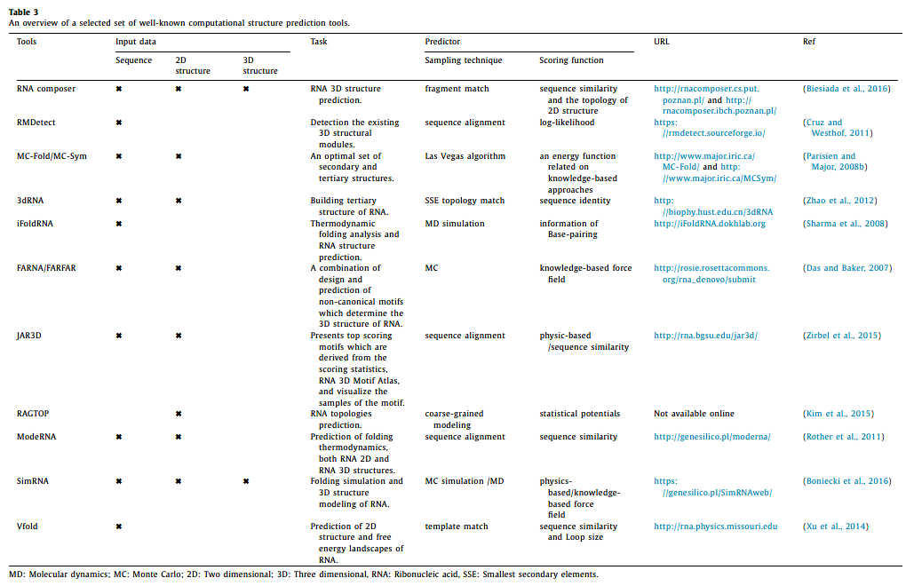
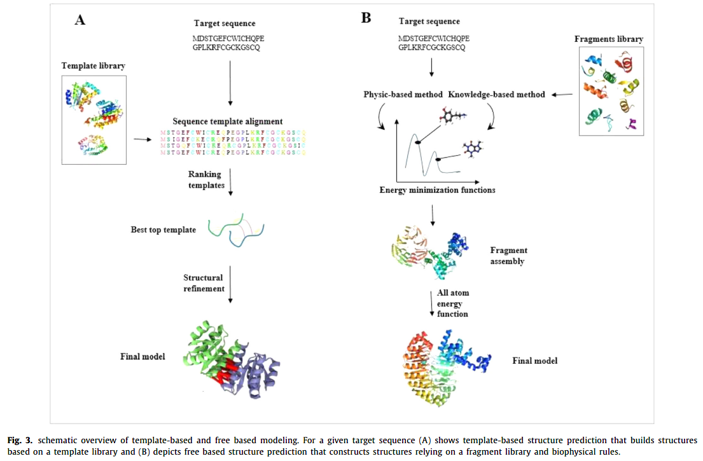

👏 综述|适配体互作以及结构的计算预测方法 

---
[TOC]

---
## 摘要
&emsp;&emsp;通常，适配体是通过SELEX实验方式筛选得到，但是该方法需要耗费大量的时间和金钱并且成功率很低。为了解决这些问题，近年发展起来一些计算方法用于辅助适配体的发现与设计。通常，适配体的计算预测方法主要分为两大类，分别是互作预测以及基于结构的预测。

## 研究背景
&emsp;&emsp;20世纪的最后一个十年研究人员开始对适配体展开研究。它们是多肽、短多链人工核酸（DNA/RNA）并且能够结合到特定的生物靶标上。适配体主要是通过范德华作用、静电作用、三维结构、堆积作用以及氢键作用与靶标互作。更重要的是适配体可以折叠成各种能够识别多种靶标位点的二级和三级结构。

&emsp;&emsp;适配体与抗体类似但是又有一些优点，其中最大的优点是高温下适配体具有稳定性。适配体可以通过PCR等技术扩增获得高纯度的分子，比抗体生产更加廉价。另外，小尺寸的适配体具有高组织浸润性和高血浆寿命。断链适配体也更加容易修饰。传统的SELEX实验方法有一定缺陷。

&emsp;&emsp;最近适配体预测计算方法的使用吸引了大众的注意力。计算方法是简单的、花费更少的时间和金钱。主要的计算方法包括：设计有效的适配体、模拟适配体选择性、SELEX计算法、互作预测和结构预测。

## 互作预测
&emsp;&emsp;理解适配体-靶标互作是相互作用预测方法的关键。这种预测对于理解互作机制以及设计更高亲和力的适配体是很关键的。包括机器学习在内的多种方法已用于适配体-靶标相互作用预测。下图展示了机器学习预测互作的主要步骤：数据收集和特征构建、计算模型构建和模型评估。

### 数据收集和特征提取
&emsp;&emsp;**数据收集：适配体-靶标互作数据库。** 这样的数据库有四个，分别是：Aptamer Database、Riboapt DB、Aptamer Base和Aptagen。

&emsp;&emsp;**指定预测方案。** （1）只以适配体作为输入进行分类建模。将适配体整长序列分为两部分：结合位点以及非结合的其他位点。按照公式（1）的方式构建数据集。

（2）以适配体和靶标共同作为输入建立分类模型。按照公式（2）的方式构建数据集。

（3）划分训练集和测试集，原始数据集的75%作为训练集，25%作为测试集。

&emsp;&emsp;**特征构建。** 主要有三种特征形式：基于序列的特征、基于结构的特征和基于能量的特征。
（1）基于序列的特征。可以从蛋白/适配体序列中提取一些物理化学（疏水性、亲水性、熵、焓和熔点等）性质、能量性质和构象性质（弯曲、上升、下跌、偏移和斜坡等）。（CCPPI、DPPI等）
（2）基于结构的特征。从原子水平上反映了氨基酸和核酸的功能。一方面基于结构能够应用结构的空间特征，另一方面可以反映残基接触、原子接触、盐桥和氢键等相互作用。
（3）基于能量的特征。主要包括静电电荷、侧链分子内能量、侧链分子间能量、范德华势能、氢键势能、环境分子间能量和界面倾向。
（4）特征提取。四种常用的方法：one-hot编码、K-mer频率、连续分布表示和扩展one-hot编码。 
（5）特征选择。在进行特征提取并将特征转换为特征向量之后，应该剔除冗余的非相关信息以提高预测算法的性能。选择合适的特征能够减少过拟合，提高预测质量。选择特征的算法主要分为三类：过滤包括不需要学习的特征提取的方法；应用学习策略评估重要特征的包装器方法；将特征选择和分类模型构建结合起来的嵌入方法。
（6）工具。pseKRAAC、iFeature和Seq2Feature。

### 计算建模
&emsp;&emsp;现研究人员已广泛使用机器学习方法进行建模。机器学习主要分为四类：监督学习、半监督学习、非监督学习和强化学习。监督学习同时需要特征和标签，监督学习模型即用于建立特征和标签之间的函数关系，回归模型、分类模型以及强化学习均是监督学习的例子。非监督学习即没有标签，常用于聚类。半监督学习介于监督学习和非监督学习之间，主动学习即是一种半监督学习方法。目前研究人员已开发的方法有：LPI-ETSLP、DLPRB、RPI-SAN。

### 模型性能评估
&emsp;&emsp;使用十折交叉检验、外部测试集验证等方法对模型进行评估。

### 适配体-靶标互作预测的机器学习方法
&emsp;&emsp;目前已有的研究方法如下表所示：

## 结构预测
&emsp;&emsp;通常，适配体结构预测主要有两种方法：基于序列的方法和基于结构的方法。主要的结构预测方法如下表所示：

### 2D结构预测
&emsp;&emsp;与单纯的序列相比，2D结构能够体现主要功能区域的保守型，对其他计算预测有更高准确度。通常，2D结构预测方法主要分为两大类：单序列分析（自由能最小化）和多序列分析（比较方法）。这些方法依赖于已有的同源折叠结构和充分的结构数据。单序列分析是基于单序列可能结构的集合寻找低能结构。多序列分析是基于进化原理。多序列分析比单序列分析有更高的预测准确度。

### 3D结构预测
&emsp;&emsp;3D结构预测方法主要分为两个主要步骤：构象采样和打分。构象采样可使用MC、MD以及从已知结构中提取摸板和片段等方法。打分是通过序列相似性、基于知识的统计分析和分子力场等对候选结构进行排序。  

&emsp;&emsp;基于摸板的方法和自由建模方法如下图所示：

&emsp;&emsp;**基于摸板的方法。** 主要包括四步：首先，寻找靶标序列相关的摸板结构。其次，将靶标序列和摸板序列进行序列比对。然后，拷贝结构比对区域填充整个结构框架。最后，添加未比对上的柔性区域和侧链原子。

&emsp;&emsp;**自由建模的方法。** 这种建模方法叫做从头建模。这种建模方法主要依赖于生物物理规则，基于此规则使用最小化自由能方法模拟折叠的过程。

## 总结
&emsp;&emsp;适配体计算方法的引入加快了研究进程，节约了时间。这篇文章综述了用于适配体计算预测的方法。

## 参考文献
📜 Emami N, Pakchin P S, Ferdousi R. Computational predictive approaches for interaction and structure of aptamers[J]. Journal of theoretical biology, 2020, 497: 110268. [文献pdf](./综述适配体互作以及结构的计算预测方法/1-s2.0-S0022519320301235-main.pdf) 