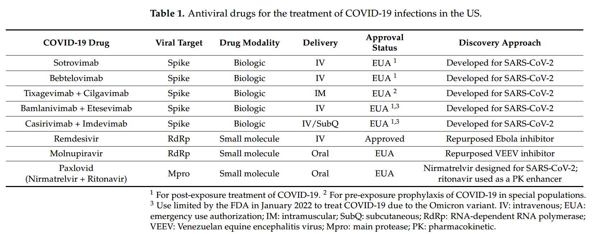
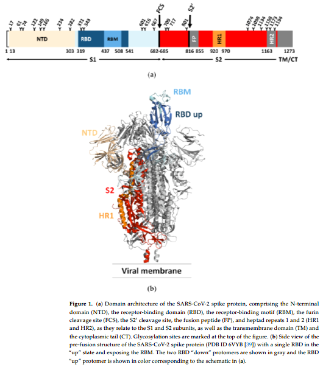
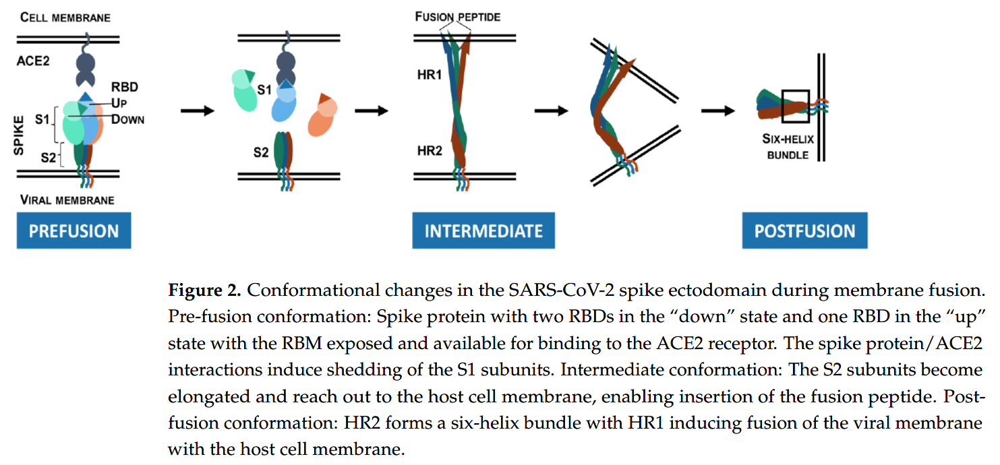
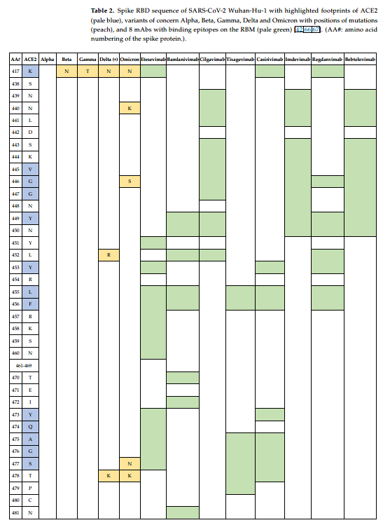
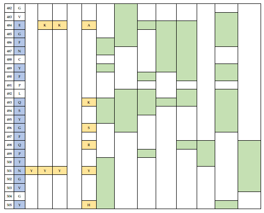
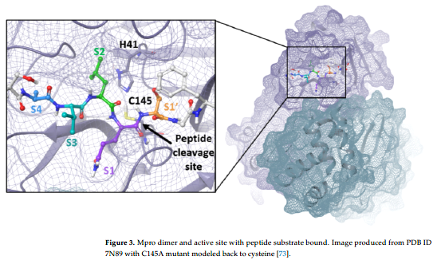
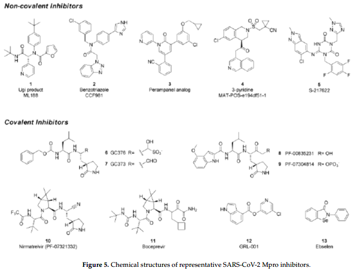

👏 药物|用于治疗新冠肺炎的抗病毒药物发现

---
[TOC]

---
## 摘要
&emsp;&emsp;目前新冠疗法主要分为抗病毒药物研究以及抗体疫苗研究。中和抗体通过靶向病毒S蛋白阻止病毒进入宿主细胞，其也是FDA紧急批准上市的主要抗体类别。除了S蛋白，其他重要靶标也是药物研究重点。这篇文章综述了用于治疗新冠肺炎的抗病毒药物发展现状以及未来研究方向。内容包括S蛋白，nsp3（Papain）蛋白，nsp5（3C）蛋白，以及nsp12/nsp7/nsp8 RdRp复合物等。

## 研究背景
### 抗新冠研究的医疗策略
&emsp;&emsp;为对抗新冠肺炎，研究人员在发现和开发医疗对策方面付出了巨大努力，包括针对新冠肺炎的疫苗和药物。新冠疫苗在控制全球新冠传染仍面临许多障碍：有限的可获得性导致全球疫苗获取的不平等；疫苗运输过程中的储藏条件等后勤问题；一些疫苗至少需要两剂才能建立免疫保护；疫苗接种后短短6个月内效果减弱，需要增强；疫苗诱导引发突变，例如Omicron变体。疫苗的这些缺陷强调了药物治疗的重要性，尤其是广谱可口服的抗新冠药物。抗新冠药物发现策略可以分为两大类：靶向宿主蛋白和靶向病毒蛋白药物研究。这篇文章主要综述了靶向病毒的抗新冠药物。

### 代表性病毒靶标
&emsp;&emsp;S蛋白、木瓜蛋白酶、主蛋白酶、RdRp是主要的抗新冠病毒靶标。针对这些蛋白的FDA批准上市的药物如下表所示：

### 抗病毒药物发现策略
&emsp;&emsp;药物发现策略主要包括：老药新用、高通量筛选、计算机辅助虚拟筛选和基于结构的药物发现。目前已有一些抗新冠老药新用的案例，例如瑞德西韦最早开发是用于治疗埃博拉，后来发现它对新冠病毒有效并成功发展成为抗新冠药物。Molnupiravir最初是用于治疗委内瑞拉脑炎病毒感染，后来发现其对其他流感病毒以及新冠有效。除了老药新用，研究也发现了一些新的抗病毒化合物，但是目前所有的抗病毒药物都有一定的局限性。例如molnupiravir不推荐孕妇使用因为其可能引发致死。Paxlovid是ritonavir和nirmatrelvir的药物组合，有可能与伴随药物发生复杂的药物-药物相互作用。由于这些局限，非常需要发现新的药物并提高抗病毒药物服用的便捷性。这篇文章综述了用于抗新冠病毒药物的发现。

## S蛋白
&emsp;&emsp;冠状病毒入侵进入宿主细胞主要需要两大步：第一步是病毒与宿主细胞受体结合，第二步是病毒包膜和宿主细胞膜融合。这两个步骤均是由S蛋白介导的。

### S蛋白结构
&emsp;&emsp;如下图1所示，S蛋白三聚体中的每个单体都含有受体结合的S1结构域和膜锚定的S2亚基。受体结合S1亚基含有NTD和RBD，RBD由核心结构域和受体结合模体（RBM）组成，病毒便是借助RBM与宿主细胞受体结合。RBM的S蛋白更倾向突变，核心区域则更加保守。膜锚定的S2亚基含有融合肽（FP），其中富含疏水残基并插入宿主细胞膜。S2亚基也含有两个七重复区HR1和HR2，它们可以形成六螺旋束将病毒基因传输到细胞质中。与许多其他病毒融合蛋白相似，新冠S蛋白表面覆盖着多糖阻止S蛋白被免疫识别。SARS和SARS2病毒的S蛋白表面多糖比HIV病毒表面多糖更加复杂。其中RBD区域覆盖的多糖更少，因此具有更多免疫原性。因此很多疫苗均是直接作用于RBD区域，也因此RBD区域发生了很多突变以产生免疫逃逸。

### S蛋白与受体互作以及病毒侵入机制
&emsp;&emsp;SARS和SARS2均是和受体ACE2互作，而MERS的受体则是DPP4。SARS和SARS2以相似的方式与受体结合，病毒入侵时除了与ACE2受体相关，还与一些病毒入侵激活蛋白cathepsin L和TMPRSS2等有关。

&emsp;&emsp;目前研究人员已经解析了新冠病毒S蛋白三聚体晶体结构。在S蛋白关闭的预融合状态，所有的RBD结构域都处于“down”状态，并且此状态下RBMs被掩藏起来不能与宿主受体结合。然而在S蛋白开放的与融合构象，多个RBDs处于“up”状态，此时RBMs显露出来能够使得S蛋白与ACE2发生互作。

&emsp;&emsp;如图2所示，结合到ACE2上的S蛋白破坏了预融合三聚体的稳定性，造成了S1亚基的脱落以及S2亚基的显著构象变化。S2亚基变成了细长型，使融合肽插入细胞膜。中间态使不稳定的并且快速的转换为稳定的融合后构象，并且此构象中HR1和HR2形成了六螺旋束。在转变过程中，病毒和宿主细胞膜彼此接近并进行膜融合。

### 识别S蛋白RBD的新冠抗体
&emsp;&emsp;根据晶体结构，靶向S蛋白RBD的抗体分为四大类型，如下所示，其中1类和2类直接阻止ACE2，3类和4类没有。1类和4类与“up”状态的RBDs，2类和3类可以与任意状态的RBDs结合。
-> 1类单克隆抗体：阻止ACE2，仅能与“up”状态的RBDs结合。许多是VH3-53或VH3-66。包括etesevimab (LY-CoV016)、casirivimab (REGN10933) 和 tixagevimab (AZD8895)。
-> 2类单克隆抗体：阻止ACE2，能与“up”和“down”状态的RBDs结合，并且能和近邻的RBDs接触。包括bamlanivimab
(LY-CoV555) 和 cilgavimab (AZD1061)。
-> 3类单克隆抗体：不阻止ACE2，能与“up”和“down”状态的RBDs结合。并能和近邻的RBDs基础限制其移动，将RBD锁在关闭的构象。包括sotrovimab (VIR-7831)，bebtelovimab (LY-CoV1404) 和 imdevimab (REGN10987)。
-> 4类单克隆抗体：不阻止ACE2，仅能与“up”状态的RBDs结合。包括C1C-A3、CR3022 和 S304。

&emsp;&emsp;抗体中和并清除新冠病毒有多种机制。抗体可以结合到RBD上并阻止RBD与受体结合因此预防病毒进入细胞。一些2类抗体可以诱导S1亚基过早脱落，因此诱导融合后构象并阻止病毒与细胞膜融合。S蛋白的二价交联可以引发空间位阻或者病毒粒子聚集并中和病毒侵入。最后，抗体的Fc部分可以与骨髓细胞和自然杀伤细胞上发现的Fc γ受体相互作用，这些互作通过抗体依赖的细胞介导的吞噬作用（ADCP），抗体依赖的细胞毒作用（ADCC）或补体通路的激活作用对病毒清除至关重要。另外，拥有多种作用机制的鸡尾酒抗体疗法可能有一定效果。

### 逃逸突变
&emsp;&emsp;RNA病毒通过RdRp进行复制并且有很高的突变率。这些突变对于设计有效的疫苗和抗体有巨大的挑战。

&emsp;&emsp;新冠VOC毒株已经对中和抗体有了抵御作用。如表2所示，β变体（B.1.351）具有E484K和K417N突变，具有最大量的免疫逃逸。然而德尔塔变体具有的L452R和T478K突变，具有更强的传染性和致病性，迅速超过了其他变体。最近流行的Omicron变体在S蛋白上有37个氨基酸突变，其中RBD中有15个，RBM中有10个。尽管S蛋白的ACE2结合位点附近有大量的突变，但是Omicron变体与ACE2的结合亲和力比初始的病毒株更强。

&emsp;&emsp;表1中的8个批准上市的单克隆抗体中有6个（bamlanivimab, etesevimab, casirivimab, imdevimab, cilgavimab, tixagevimab）都是阻止S蛋白与ACE2结合的。第二类单克隆抗体，例如sotrovimab，不阻止与ACE2结合，而是通过靶向非RBM的抗原表位中和病毒。两类抗体的体外中和Omicron变体病毒活性相比显示RBM特异的抗体基本都失去活性，Sotrovimab效力减弱了3倍。2022年2月FDA授权的Bebtelovimab基本可以与当前所有的VOC变体结合并中和。其结合的抗原表位与imdevimab相似。

### 结论与未来研究方向
&emsp;&emsp;RBD具有高度的免疫原性并且也更倾向于积累突变。膜锚定的S2亚基具有高度的序列保守性并且含有膜融合机制。系列研究发现S2特异的单克隆抗体是有效的并且它们的结合能抑制构象变化从而阻止病毒于细胞膜融合，这些单克隆抗体结合当前其他抗新冠疗法或许能发挥广谱抗新冠变体作用。

## 主蛋白酶
### 结构与功能
&emsp;&emsp;新冠病毒主蛋白酶是一个33.8 kDa的蛋白，其对于病毒多聚蛋白的裂解以及病毒的复制非常重要。X-ray分析揭示两个主蛋白酶结合形成二聚体对其发挥催化活性至关重要。如下图所示，主蛋白酶由三个结构域组成，结构域Ⅰ和结构域Ⅱ形成催化活性位点，该位点包含Cys145、His41、底物结合位点、S1、S2、S4和S1'。主蛋白酶是一个广谱抗新冠病毒药物开发的重要靶标。

### 主蛋白酶抑制剂的发现
&emsp;&emsp;新冠主蛋白酶抑制剂可分为共价和非共价两类，如图5所示。前者多是拟肽，结构中含有P1谷氨酰胺类似片段提供特异性并且提高亲和力以及亲脂的P2亚基。通常使用醛、酮、迈克尔受体和精基作为共价结合弹头。后者非共价抑制剂设计依赖氢键、范德华作用力和疏水作用。据推测非共价药物由于缺乏反应性官能团可能降低脱靶毒性但是可能抑制效果更弱，作用时间更短。

&emsp;&emsp;

## 参考文献
1. Ng T I, Correia I, Seagal J, et al. Antiviral Drug Discovery for the Treatment of COVID-19 Infections[J]. Viruses, 2022, 14(5): 961. [文献pdf](./药物用于治疗新冠肺炎的抗病毒药物发现/viruses-14-00961.pdf)