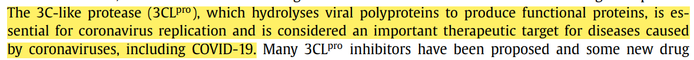
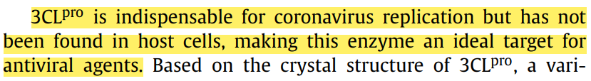
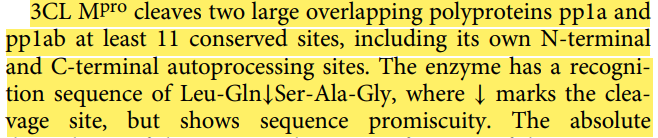
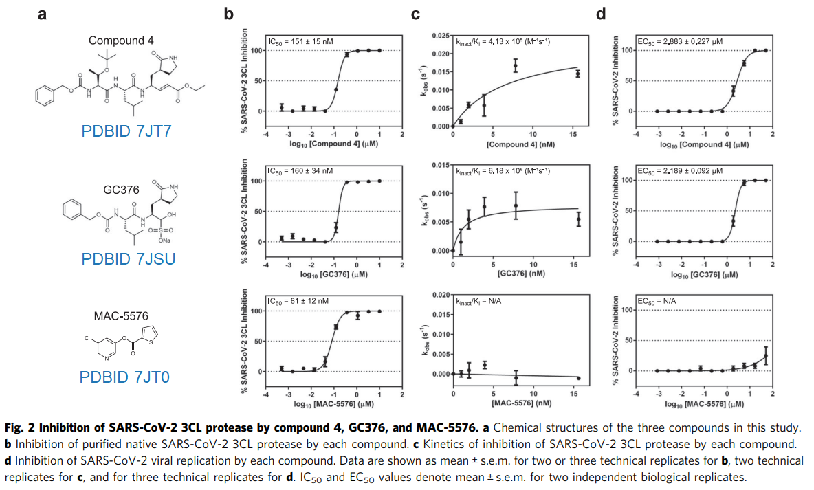
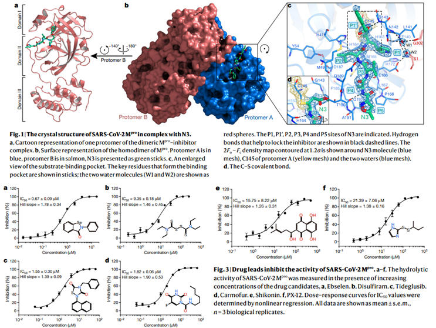

👏 靶标|SARS2的3CL蛋白

---
[TOC]

---
## SARS2 3CL蛋白功能
1. He J, Hu L, Huang X, et al. Potential of coronavirus 3C-like protease inhibitors for the development of new anti-SARS-CoV-2 drugs: Insights from structures of protease and inhibitors[J]. International journal of antimicrobial agents, 2020, 56(2): 106055.

2. Kneller D W, Phillips G, O’Neill H M, et al. Structural plasticity of SARS-CoV-2 3CL Mpro active site cavity revealed by room temperature X-ray crystallography[J]. Nature communications, 2020, 11(1): 1-6.

## SARS2 3CL蛋白结构
**室温下的3CL蛋白活性位点结构**
1. Kneller D W, Phillips G, O’Neill H M, et al. Structural plasticity of SARS-CoV-2 3CL Mpro active site cavity revealed by room temperature X-ray crystallography[J]. Nature communications, 2020, 11(1): 1-6.

## SARS2 3CL抑制剂
1. Iketani S, Forouhar F, Liu H, et al. Lead compounds for the development of SARS-CoV-2 3CL protease inhibitors[J]. Nature communications, 2021, 12(1): 1-7. **共价** [pdf](靶标SARS2的3CL蛋白/s41467-021-22362-2.pdf)

2. Jin Z, Du X, Xu Y, et al. Structure of Mpro from SARS-CoV-2 and discovery of its inhibitors[J]. Nature, 2020, 582(7811): 289-293. [pdf](靶标SARS2的3CL蛋白/s41586-020-2223-y.pdf)

