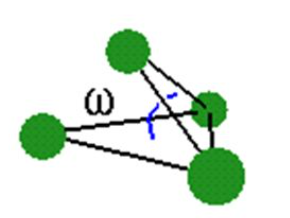

## 书籍|切尔诺贝利的午夜

## 电视剧|开端

## 书籍|共同基金常识

## 感想
(1) 计算成本是多么的重要。  

## 动手学深度学习-李沐
(1) 卷积神经网络就相当于一个受限的全连接神经网络。  
(2) 卷积中一般的设置方法是feature的高和宽减半，同时把通道的数目翻倍。  
(3) 批量归一化：  
  
  
  
  
  

(4) 残差神经网络：  
如果说卷积神经网络中只学习一个经典网络的话，那就是残差神经网络ResNet。  
深度学习中一定要避免除以零，所以可以在分母中加一个很小的常数。  
  
  
  

(5) CPU和GPU：  
  
  
  

(6) 少量的高质量的数据比大量的低质量的数据效果要好。  

(7) 图片是空间信息的数据格式，序列是时间信息的数据格式。  

(8) RNN  
  

(9) GRU  
- 能关注的机制（更新门），对于比较重要的数据，用这个门尽量的更新隐藏状态。把信息尽量多的放到隐藏状态中，这样有利于后续序列。  
- 能遗忘的机制（重置门），对于前面不重要的输入或者隐藏状态。  

## mermaid流程图工具

## 分子相似性
参考：  
(1) https://blog.csdn.net/qq_48188780/article/details/109453096 

一定要抽空把attention和resent两篇文章看完，并且把李沐关于RNN和Transformer的视频看完。

RNN和CNN的比较：  
https://easyai.tech/ai-definition/rnn/  

交叉验证:  
https://blog.csdn.net/aliceyangxi1987/article/details/73532651  

深度学习中过拟合与防止过拟合的方法:  
https://blog.csdn.net/chen645096127/article/details/78990928  

深度学习入门——神经网络的正则化:  
https://blog.csdn.net/qq_35712832/article/details/114218032  

文献阅读：  
(1) https://www.eurekaselect.com/article/53238   

神经网络可视化：  

很好的想法：最后的预测结果可以加一个置信区间的信息。  
   

图神经网络：  
(1) 

impropers dihedral angular
